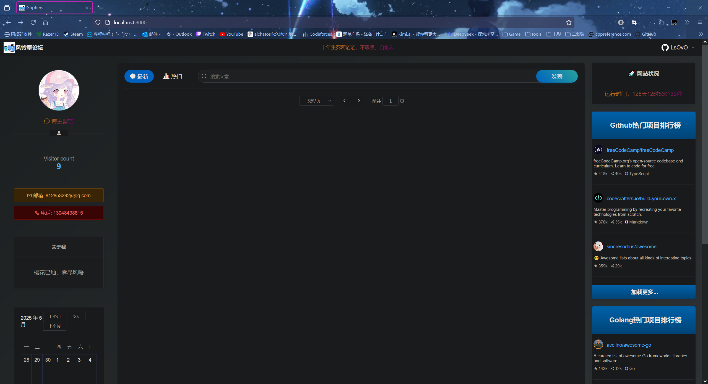
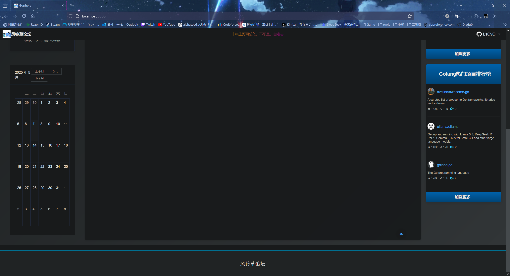
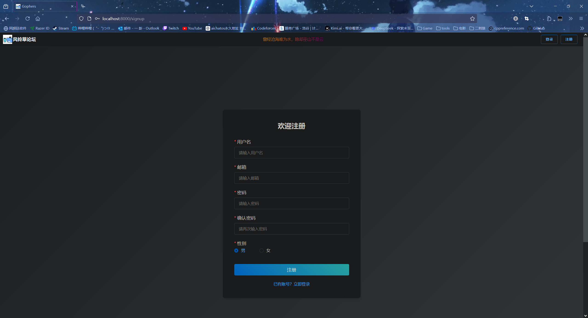
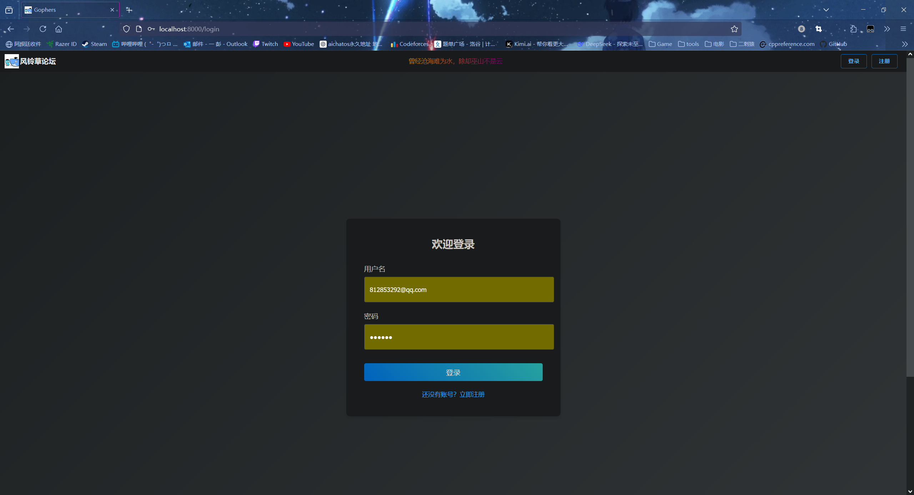

# bluebell-plus

- 微信：13048438815

- qq：812853292

## 技能清单

1. 雪花算法
2. gin框架
3. zap日志库
4. Viper配置管理
5. swagger生成文档
6. JWT认证
7. 令牌桶限流
8. Go语言操作MySQL **(sqlx)**
9. Go语言操作Redis **(go-redis)**
10. Gihub热榜
11. Docker部署
12. Vue框架
13. ElementUI
14. axios 
15. 畅言云评论系统

## 项目目录结构

### 后端结构树

```bash
.
├── Dockerfile
├── Makefile
├── README.md
├── bin
│   ├── bluebell-plus
│   └── bluebell-plus.conf
├── conf
│   └── config.yaml
├── controller
│   ├── code.go
│   ├── comment.go
│   ├── community.go
│   ├── doc_response_models.go
│   ├── post.go
│   ├── post_test.go
│   ├── request.go
│   ├── response.go
│   ├── user.go
│   ├── validator.go
│   └── vote.go
├── dao
│   ├── mysql
│   │   ├── comment.go
│   │   ├── community.go
│   │   ├── error_code.go
│   │   ├── mysql.go
│   │   ├── post.go
│   │   ├── post_test.go
│   │   └── user.go
│   └── redis
│       ├── error.go
│       ├── keys.go
│       ├── post.go
│       ├── redis.conf
│       ├── redis.go
│       └── vote.go
├── docker-compose.yml
├── docs
│   ├── docs.go
│   ├── swagger.json
│   └── swagger.yaml
├── go.mod
├── go.sum
├── init.sql
├── log
│   └── bluebell-plus.log
├── logger
│   └── logger.go
├── logic
│   ├── community.go
│   ├── post.go
│   ├── truncate.go
│   ├── user.go
│   └── vote.go
├── main.go
├── middlewares
│   ├── auth.go
│   └── ratelimit.go
├── models
│   ├── comment.go
│   ├── community.go
│   ├── create_tables.sql
│   ├── params.go
│   ├── post.go
│   └── user.go
├── pkg
│   ├── jwt
│   │   └── jwt.go
│   └── snowflake
│       └── gen_id.go
├── routers
│   └── routers.go
├── settings
│   └── settings.go
├── static
│   ├── css
│   │   ├── app.5c39da08.css
│   │   └── chunk-vendors.5b539fe5.css
│   ├── favicon.ico
│   ├── fonts
│   │   ├── element-icons.535877f5.woff
│   │   ├── element-icons.732389de.ttf
│   │   ├── fontello.068ca2b3.ttf
│   │   ├── fontello.8d4a4e6f.woff2
│   │   ├── fontello.a782baa8.woff
│   │   └── fontello.e73a0647.eot
│   ├── img
│   │   ├── avatar.7b0a9835.png
│   │   ├── fontello.9354499c.svg
│   │   ├── iconfont.cdbe38a0.svg
│   │   ├── logo.938d1d61.png
│   │   └── search.8e85063d.png
│   └── js
│       ├── app.81e7c3d0.js
│       ├── app.81e7c3d0.js.map
│       ├── chunk-vendors.218b058e.js
│       └── chunk-vendors.218b058e.js.map
├── templates
│   └── index.html
├── version.go
└── wait-for.sh
```

### 前端结构树

```bash
├── bin
│   └── bluebell-plus
├── conf
│   └── config.yaml
├── static
│   ├── css
│   │   └── app.0afe9dae.css
│   ├── favicon.ico
│   ├── img
│   │   ├── avatar.7b0a9835.png
│   │   ├── iconfont.cdbe38a0.svg
│   │   ├── logo.da56125f.png
│   │   └── search.8e85063d.png
│   └── js
│       ├── app.9f3efa6d.js
│       ├── app.9f3efa6d.js.map
│       ├── chunk-vendors.57f9e9d6.js
│       └── chunk-vendors.57f9e9d6.js.map
└── templates
    └── index.html
```

## 项目预览图










